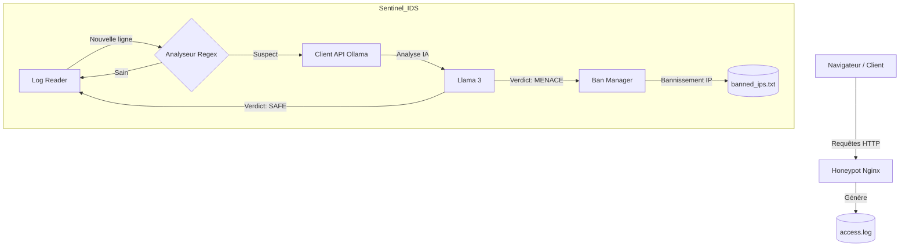
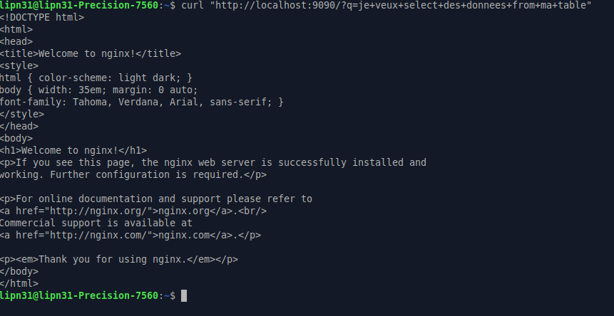

# Titre du projet : Sentinel Réseau - IDS avec IA Locale

## Description
Système de Détection d'Intrusions (IDS) de nouvelle génération. En combinant un honeypot classique avec l'analyse sémantique puissante d'une intelligence artificielle locale (**Ollama / Llama 3**), Sentinel identifie, qualifie et bloque de manière autonome les requêtes malveillantes en temps réel, le tout dans un environnement Dockerisé.

## Architecture



- **Nginx (Honeypot)** : Serveur web cible exposant des logs d'accès.
- **Sentinel (Python)** : Script modulaire qui surveille les logs, filtre les requêtes suspectes et interroge l'IA.
- **Ollama** : Moteur d'IA local (tournant sur l'hôte) pour valider les menaces.

### Affichage de résultats




## Installation et Lancement

1. **Pré-requis : Ollama**
   Installez Ollama et assurez-vous qu'il accepte les connexions réseau :

   ```bash
   # Configurer l'hôte (Linux)
   sudo mkdir -p /etc/systemd/system/ollama.service.d
   echo -e '[Service]\nEnvironment="OLLAMA_HOST=0.0.0.0"' | sudo tee /etc/systemd/system/ollama.service.d/override.conf
   sudo systemctl daemon-reload && sudo systemctl restart ollama

   # Télécharger le modèle
   ollama pull llama3:8b
   ```

2. **Démarrer l'IDS**
   ```bash
   docker compose up --build
   ```

## Tests et Qualité

Le projet inclut une suite de tests unitaires pour valider la détection sans Docker :

```bash
python3 sentinel/test_analyzer.py
```

Une **CI (GitHub Actions)** est configurée pour lancer ces tests automatiquement à chaque push.

## Rapport de Sécurité

Pour générer un résumé des menaces détectées (basé sur `banned_ips.txt`) :

```bash
python3 sentinel/report_generator.py
```

Le serveur Nginx est accessible sur `http://localhost:9090`.

- **Requête Légitime** (Silencieuse) :
  `curl http://localhost:9090/`
- **Détection IA (Faux Positif)** :
  `curl "http://localhost:9090/?q=je+veux+select+des+donnees+from+ma+table"`
- **Détection IA (Attaque Réelle)** :
  `curl "http://localhost:9090/?q=union%20select%201,2,3"`

## Captures d'écran

<!-- Placez vos captures d'écran dans le dossier "screenshots" et intégrez-les ici avec la syntaxe suivante : -->
<!--  -->

## Structure du Projet

- `sentinel/` : Code source Python modulaire.
- `logs/` : Volume partagé pour les logs Nginx.
- `docker-compose.yml` : Orchestration des services.
- `screenshots/` : Emplacement pour vos captures d'écran.
